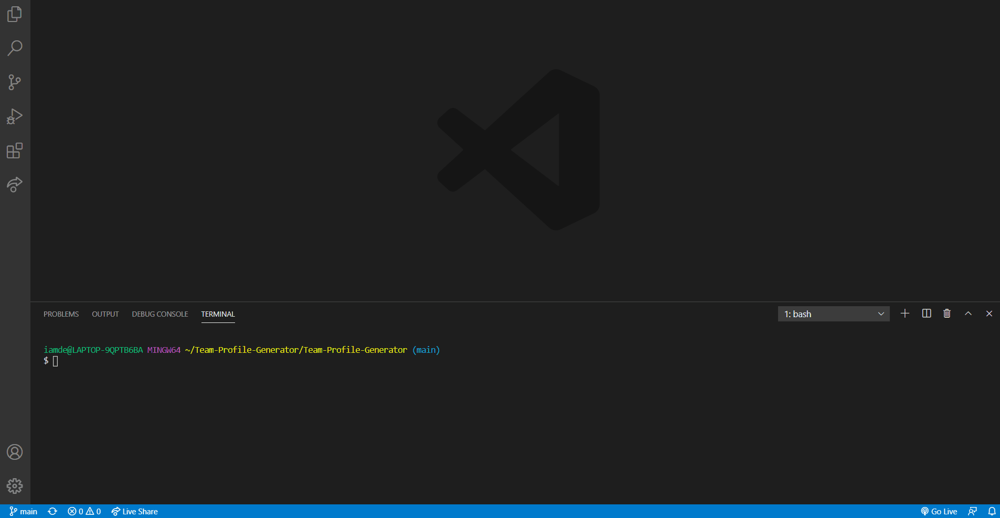

# Team Profile Builder
# Description
A Node.js command-line application that takes in information about employees on a software engineering team, then generates an HTML webpage that displays summaries for each person.
# Deployed site:
 [EXAMPLE HTML](https://deseancarter.github.io/Team-Profile-Generator/)
 # In Progress

# Table of Contents
* [Installation](#installation)
* [Usage](#usage)
* [License](#license)
* [Contributing](#contributing)
* [Tests](#tests)
* [Questions](#questions)
# Installation
npm init. npm install inquirer.
# Usage
Run in command line the answer the questions to generate team profile.
# License
This work is covered under the CC0 1.0 Universal license.
Full license information can be found here: [License: CC0-1.0](http://creativecommons.org/publicdomain/zero/1.0/)

# Contributing
N/A
# Tests
Install and run.
# Questions
Email
